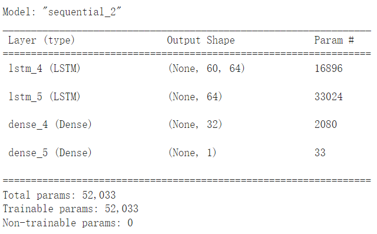
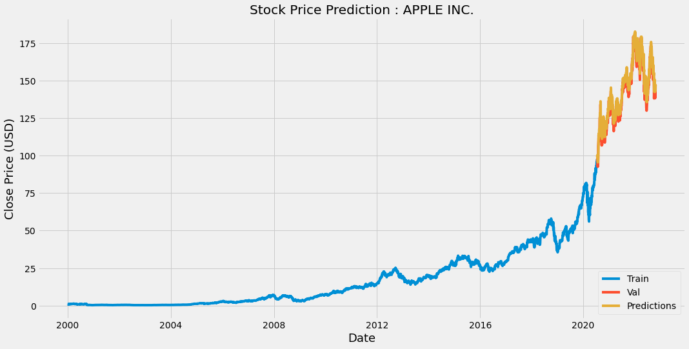

# Introduction
## Background
各种机器学习算法，例如神经网络，遗传算法，支持向量机等，都可用于预测股票价格。循环神经网络（RNN）是其中一个适合处理顺序数据的有效模型，例如声音，时间序列数据等。股票价格数据就是一种典型的时间序列数据。
LSTM(Long short-term memory )是目前比较成功且普遍使用的RNN架构之一[^1]。
## Introduction of LSTM
LSTM引入了内存单元(memory cells)，这是一个计算单元，它取代了传统神经网络隐藏层中的人造神经元。

原始的RNN基本结构图(图源：[Understanding LSTM](http://colah.github.io/posts/2015-08-Understanding-LSTMs/))


RNN展开后由多个相同的单元连续连接。即随着不断的循环，上述自我循环的结构把上一次的状态传递给当前输入，一起作为新的输入数据进行当前轮次的训练和学习，一直到输入或者训练结束，最终得到的输出即为最终的预测结果。

LSTM基本结构图：


LSTM细胞由输入门、遗忘门、输出门和单元状态组成：
* 输入门：决定当前时刻网络的输入数据有多少需要保存到单元状态。
* 遗忘门：决定上一时刻的单元状态有多少需要保留到当前时刻。
* 输出门：控制当前单元状态有多少需要输出到当前的输出值 [^2][^3]。

LSTM最大的优势就是相比RNN来说在各个应用场景上带来了比较大的效果提升。提升的原因通常被认为就是它富有开创性的长短时记忆的结构。除此之外，LSTM还解决了RNN的梯度消失和爆炸问题。RNN的梯度消失和爆炸问题主要是由于RNN的权值矩阵循环相乘导致的。RNN的循环结构会导致它需要反复乘上自己的权值矩阵，而相同函数的多次组合会导致极端的非线性行为。LSTM通过其自身复杂的结构可以很好的解决上述问题。[^4]。

# Building Model
我们的模型由以下部分组成：
1. 两个具有 64 个神经元的 LSTM 层，一个作为输入层，一个作为隐藏层
2. 两个 Dense 层，一个具有 32 个神经元，作为全连接层；另一个具有 1 个神经元，作为输出层。

``` python
# Build LSTM model
model=Sequential()
model.add(LSTM(units=64,return_sequences=True,input_shape=(x_train.shape[1],1)))
model.add(LSTM(units=64,return_sequences=False))
model.add(Dense(units=32))
model.add(Dense(units=1))
model.summary()
```


# Result



# References
[^1]:[Chen, K., Zhou, Y., &amp; Dai, F. (2015). A LSTM-based method for stock returns prediction: A case study of china stock market. 2015 IEEE International Conference on Big Data (Big Data).](https://doi.org/10.1109/bigdata.2015.7364089)  
[^2]:[长短期记忆神经网络（LSTM）介绍以及简单应用分析. 开发者的网上家园. (n.d.). Retrieved October 25, 2022](https://www.cnblogs.com/liuzhen1995/p/11625684.html )
[^3]:[Understanding LSTM networks. Understanding LSTM Networks -- colah's blog. (n.d.). Retrieved October 25, 2022 ](http://colah.github.io/posts/2015-08-Understanding-LSTMs/ )
[^4]:[Wenqian. (2020, May 10). 长短时记忆网络--LSTM. 文谦的博客 | Wenqian Blog. Retrieved October 25, 2022](http://www.wenqianzhao.cn/2020/05/10/lstm/)


